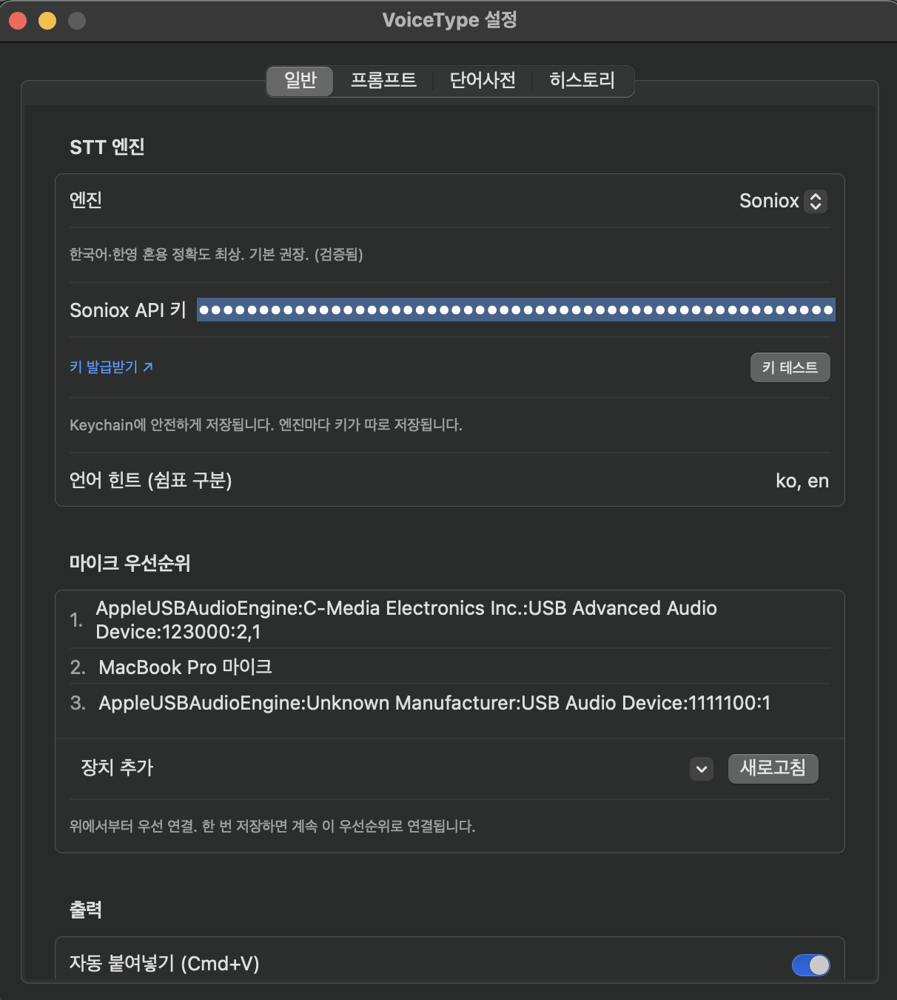

# VoiceType

Free, open-source macOS dictation with real-time streaming STT — bring your own API key.

[](https://github.com/gyujeongion/voicetype/releases/latest/download/VoiceType-1.0.0.dmg)


> **[⬇ Download VoiceType 1.0.0 (DMG)](https://github.com/gyujeongion/voicetype/releases/latest/download/VoiceType-1.0.0.dmg)** — macOS 14+  
> Open DMG → drag to Applications → launch → grant Microphone + Accessibility permissions.

---

Most dictation apps work like this: record → stop → wait → text. You speak into a void.

VoiceType streams over a persistent WebSocket. Words appear on the floating indicator **as you talk** — you get real-time feedback mid-sentence. Press your hotkey again and the final transcript is injected at your cursor.

No server. No subscription. Audio goes directly from your mic to the STT provider you choose.

---

## How it compares

| | VoiceType | Spokenly | Superwhisper | Wispr Flow |
|---|---|---|---|---|
| Real-time streaming | ✅ word-by-word | ✅ subscription only | ❌ batch | ❌ batch |
| Bring your own key | ✅ | partial | partial | ❌ |
| Deepgram BYOK | ✅ | ❌ | ✅ | ❌ |
| Soniox BYOK | ✅ | ❌ | ❌ | ❌ |
| No server middleman | ✅ | ❌ | ❌ | ❌ |
| Free | ✅ | freemium | $8.49/mo | $13.99/mo |
| Open source | ✅ | ❌ | ❌ | ❌ |

---



## Features

- **Option+Space** — toggle dictation. Speak. Press again to inject text at cursor.
- **Option+Shift+Space** — same flow, translates to English before injecting.
- **Custom hotkeys** — reassign any profile to any key combination in Settings.
- **Custom vocabulary** — register names, terms, brands. STT learns the exact spelling.
- **LLM post-processing** — optional cleanup, translation, or custom instruction per profile. Groq, Gemini, DeepSeek, Claude, OpenAI, OpenRouter, or any OpenAI-compatible endpoint.
- **History** — last 300 dictations with raw transcript and processed output.
- **Microphone priority** — ordered fallback list. Automatically switches when your preferred mic connects.
- **Sparkle auto-update** — notified when a new version is available.

---

## Install

Download the latest `VoiceType.zip` from [Releases](https://github.com/gyujeongion/voicetype/releases), unzip, and move `VoiceType.app` to `/Applications`.

On first launch, you'll grant microphone permission, Accessibility permission (for auto-paste), and enter your API key.

> If macOS shows a Gatekeeper warning: System Settings → Privacy & Security → Open Anyway.

```bash
# Homebrew
brew install --cask voicetype
```

---

## Setup

### 1. Get an STT key

| Provider | Speed | Free tier | Best for |
|---|---|---|---|
| **Deepgram** | Fastest | $200 credit | English, low latency |
| **Soniox** | Fast | Free credits | Korean, mixed Korean/English |

- Deepgram: [console.deepgram.com](https://console.deepgram.com) → API Keys
- Soniox: [console.soniox.com](https://console.soniox.com) → API Keys

### 2. Grant permissions

- **Microphone** — required to capture audio.
- **Accessibility** — required for auto-paste (Cmd+V synthesis). Optional: text is always copied to clipboard so you can paste manually.

The setup wizard handles both on first launch.

### 3. Use it

| Shortcut | Action |
|---|---|
| `Option+Space` | Start / stop dictation |
| `Option+Shift+Space` | Start / stop — translate to English |
| `Cmd+,` | Open Settings |
| Menu bar icon | Access history, settings, update check |

All shortcuts are remappable. Add more profiles (with any instruction) in Settings → Profiles.

---

## LLM post-processing

Optional. Cleans up filler words, translates, summarises — whatever instruction you set per profile.

Ranked by speed for post-processing:

| Provider | Latency | Notes |
|---|---|---|
| **Groq** | ~0.1–0.2s | Fastest. Free tier. `llama-3.1-8b-instant` |
| **Gemini** | ~0.4s | Strong Korean. `gemini-2.5-flash-lite` |
| **DeepSeek** | ~0.9s | Use `deepseek-chat` only — reasoning models add 4–6s |
| **Claude** | ~0.5–1s | Highest quality. `claude-haiku-4-5` for speed |
| **OpenAI** | ~0.5–1s | `gpt-4o-mini` |
| **OpenRouter** | varies | Access any model with one key |

---

## Custom vocabulary

Go to Settings → Vocabulary. Enter terms separated by newlines or commas.

```
Four Tet, Floating Points, Burial
에이펙스 트윈 (Aphex Twin)
Roland TR-808
```

Parenthetical aliases register both forms: `에이펙스 트윈 (Aphex Twin)` → STT recognises both `에이펙스 트윈` and `Aphex Twin`.

---

## Build

```bash
git clone https://github.com/gyujeongion/voicetype.git
cd voicetype
swift build       # or: swift test
./build_app.sh release
open VoiceType.app
```

Requirements: macOS 14+, Swift 6 (Xcode 16+).

### CLI transcription test

```bash
# Pipe a 16kHz mono s16le PCM file to test the STT pipeline without the GUI
SONIOX_API_KEY=<key> .build/debug/VoiceType --transcribe-file audio.s16le
```

### Adding a new STT engine

Implement `STTEngine` and register it in `STTEngineFactory`:

```swift
protocol STTEngine: AnyObject {
    func start(apiKey: String, languageHints: [String], terms: [String], customEndpoint: String?)
    func finish()
    func cancel()
    func sendAudio(_ data: Data)
    var onUpdate: ((String, String) -> Void)? { get set }  // (final, interim)
    var onFinished: ((String) -> Void)? { get set }
    var onError: ((Error) -> Void)? { get set }
}
```

---

## Architecture

```
Sources/
├── VoiceTypeCore/       Platform-agnostic logic — no AppKit/AVFoundation deps
│   ├── AppSettings      Settings model with lenient decoding
│   ├── SonioxProtocol   WebSocket message encoding/decoding
│   ├── TranscriptAssembler  Merges streaming tokens into final/interim text
│   ├── TermDictionary   Custom vocabulary parser
│   ├── PostProcessor    LLM request builder (OpenAI-compatible)
│   ├── LLMPresets       Provider presets ranked by speed
│   └── STTConfig        STT provider presets
└── VoiceType/           macOS app layer
    ├── AppDelegate       Menu bar, hotkey registration, indicator coordination
    ├── DictationController  State machine: idle → recording → finishing
    ├── AudioCapture      AVAudioEngine → 16kHz mono s16le PCM
    ├── SonioxClient      Soniox WebSocket (finalize / <fin> handshake)
    ├── DeepgramClient    Deepgram Nova-3 WebSocket
    ├── HotkeyManager     Carbon RegisterEventHotKey (global, multi-profile)
    ├── TextInjector      Clipboard + Cmd+V synthesis (Accessibility)
    ├── RecordingIndicator  NSPanel floating level meter
    └── UpdaterManager    Sparkle auto-update
Tests/VoiceTypeCoreTests/   22 unit tests, no network or GUI deps
```

Key implementation notes:
- Soniox termination: send `{"type":"finalize"}` → wait for `<fin>` token → strip from output. The `finished` message arrives late or not at all.
- Audio format: 16kHz mono signed 16-bit little-endian, 0.1s frames (3200 bytes).
- API keys stored in macOS Keychain (`com.ion.voicetype`), never on disk or in UserDefaults.
- Settings persist across reinstalls at `~/Library/Application Support/VoiceType/settings.json`.

---

## Security

- API keys: Keychain only.
- Audio: sent directly to your chosen STT provider. VoiceType has no server.
- LLM text: sent directly to your chosen LLM endpoint.
- History: stored locally at `~/Library/Application Support/VoiceType/history.json`. Can be disabled.
- Permissions: microphone (recording only), Accessibility (optional, for auto-paste).

Report vulnerabilities via [GitHub Security Advisories](https://github.com/gyujeongion/voicetype/security/advisories/new). See [SECURITY.md](SECURITY.md).

---

## Contributing

Bug reports, feature requests, and PRs are welcome. See [CONTRIBUTING.md](CONTRIBUTING.md).

---

## License

MIT — see [LICENSE](LICENSE).

## Credits

[Sparkle](https://sparkle-project.org) for auto-update.
